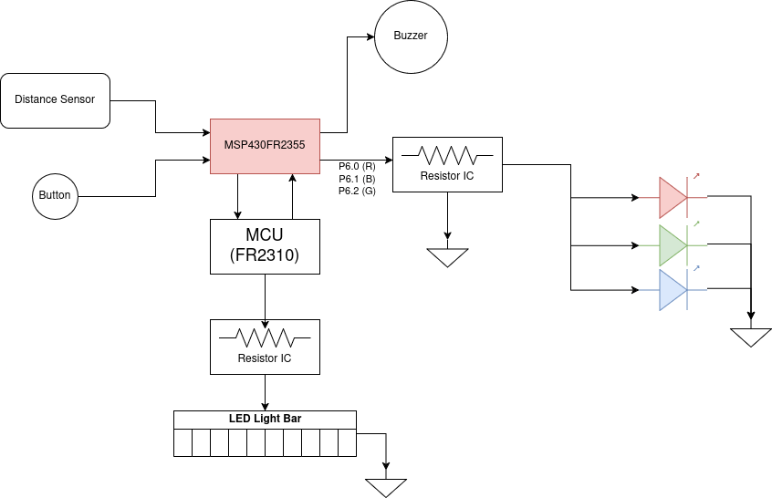
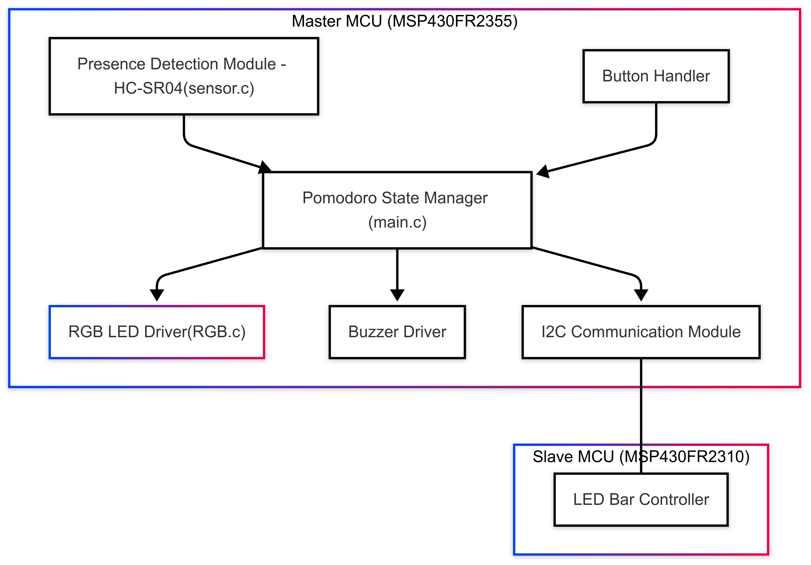

# Final Project Proposal

- [X] I have reviewed the project guidelines.  
- [X] I will be working alone on this project.  
- [X] No significant portion of this project will be (or has been) used in other course work.

---

## Embedded System Description

This project is a **Pomodoro Technique Desk Monitor** — a productivity tool that helps users follow the Pomodoro method using real-time physical feedback. The system detects whether a user is sitting at their desk using an **HC-SR04 ultrasonic sensor**. Upon presence detection, a 25-minute focus timer begins, followed by a 5-minute break.

The system provides feedback through:
- An **RGB LED** (green = focus, blue = break, red = overtime) — controlled by the **master**
- A **buzzer** to signal phase changes — also controlled by the **master**
- An **LED bar** that fills progressively during each Pomodoro session — controlled by the **slave**

A **push button** allows the user to skip to the next phase or reset the timer. The system is implemented using a master/slave topology with I²C communication between the microcontrollers.

---

## Hardware Setup

- **MSP430FR2355** (Master)
- **MSP430FR2310** (Slave)
- **HC-SR04 Ultrasonic Sensor** *(new hardware)*
- **RGB LED**
- **8-Segment LED Bar**
- **Buzzer**
- **Push Button**

The master polls the ultrasonic sensor, tracks time, handles session logic, and controls the RGB LED and buzzer. It sends I²C messages to the slave, which handles updates to the LED bar.

---

## Software Overview

- The **master** uses the HC-SR04 to detect presence and starts the Pomodoro timer when the user is seated.
- It tracks the current state (focus or break) and elapsed time.
- It drives the **RGB LED** and **buzzer** directly based on the session state.
- It sends messages via I²C to the **slave**, instructing it to update the LED bar based on time progress.
- The **slave** listens for I²C commands and lights up the LED bar accordingly.

---

## Testing Procedure

1. **Sensor Calibration**  
   - Verify accurate detection of a seated user (~< 50 cm range)

2. **Timer Logic**  
   - Test 25-minute focus and 5-minute break cycle
   - Ensure correct RGB LED color and buzzer activation at phase transitions

3. **Output Verification**  
   - LED bar lights segments evenly over time (based on messages from master)
   - Push button correctly resets or skips session

4. **Demo Plan**  
   - Simulate a shortened Pomodoro session (e.g., 2-minute focus, 30-second break) for testing in lab

---

## Prescaler

Desired Prescaler level:

- [ ] 100%  
- [ ] 95%  
- [X] 90%  
- [ ] 85%  
- [ ] 80%  
- [ ] 75%  

---

### Prescaler Requirements

**The inputs to the system will be:**
1. **HC-SR04 Ultrasonic Distance Sensor** – detects user presence at the desk  
2. **Push Button** – allows manual reset or skip to next phase  

**The outputs of the system will be:**
1. **RGB LED** – indicates focus, break, or overtime status (controlled by master)  
2. **Buzzer** – audible alert when it’s time to switch phases (controlled by master)  
3. **LED Bar** – visual indication of time progress during Pomodoro (controlled by slave)  

**The project objective is:**  
To help users follow the Pomodoro productivity method by providing real-time feedback on their focus and break cycles using an embedded monitoring system.

**The new hardware or software modules are:**
1. **HC-SR04 Ultrasonic Sensor** – new hardware module not used in EELE 465 or 371  
2. **Pomodoro timing and state management** – new application logic combining session timers with real-time feedback  

**The Master will be responsible for:**  
Tracking presence using the ultrasonic sensor, managing the Pomodoro timer and session states, directly driving the RGB LED and buzzer, and sending I²C messages to the slave.

**The Slave(s) will be responsible for:**  
Receiving I²C commands from the master and updating the LED bar to reflect elapsed time in the current session.

---

### Argument for Desired Prescaler

This project meets the **90% prescaler** level by introducing one **new hardware component** (the HC-SR04) and applying class concepts in a novel and meaningful way. It uses a **master/slave I²C topology**, manages real-time state transitions for focus and break cycles, and provides **multi-modal feedback** (visual and audio).

The system has a clear real-world purpose, encourages healthy work behavior, and demonstrates the integration of timing, sensing, and communication — all key course objectives. The LED bar adds an additional dynamic element that enhances user feedback and helps visually track time progression during sessions.
